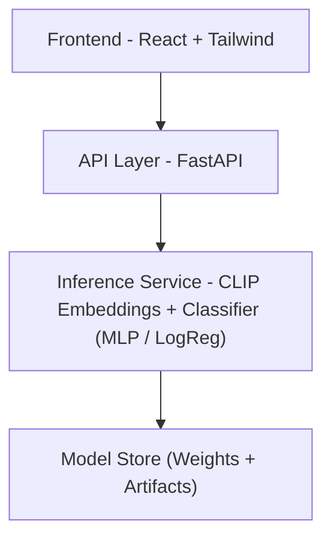

<div align="center">

# AI Image Detector

### Detect whether an image is real or AI-generated using ML + Web technologies
</div>

## 🧭 Project Overview

This project aims to build a full-stack web application that can classify whether an uploaded image is AI-generated or real.

**The system includes:**

- 📦 **Dataset Pipeline** – Collect & label real vs. AI images

- 🤖 **Model Training** – Metadata features, CLIP embeddings, Vision Transformer fine-tuning

- 🔍 **Explainability** – Grad-CAM / saliency heatmaps

- 🌐 **Backend API** – FastAPI-based inference service

- 💻 **Frontend Web App** – Upload image → receive prediction & confidence

- 🚀 **Deployment** – Containerized (Docker) and deployed to cloud

This repository is part of the EECS Club Winter Projects, built by Members of EECS Club.

---

## 🏗️ System Architecture


### 📚 Tech Stack
### Frontend
- ⚛️ **React 18.3** - Modern UI framework
- 🎨 **Tailwind CSS** - Utility-first styling
- 🎯 **Vercel** - for deployment
### Backend
- 🚀 **FastAPI** - High-performance Python framework
- 🐘 **PostgreSQL** - Robust relational database
- 🔥 **Supabase** - Real-time database & auth
- 🐎 **Uvicorn** - Fast, lightweight web server implementation for Python
- 🐍 **Pydantic** - validation and settings management
- 🐳 **Docker** - Shipping and Running Applications

### ML/AI
- 🔦 **PyTorch**
- 📊 **Scikit-learn** (Logistic Regression / XGBoost)
- ⏱️ **timm** (ViT models)
- 🧠 NumPy, Pillow, OpenCV

## 🗂️ Repository Structure
```
/project-root
│
├── frontend/               # React app
│
├── backend/                # FastAPI server
│   ├── main.py             # API entrypoint
│   ├── routers/            # API routes
│   ├── models/             # Pydantic schemas
│   └── services/           # Handles inference
│
├── inference/              # ML Inference code
│   ├── clip_inference.py
│   ├── vit_inference.py
│   └── explainability.py
│
├── training/               # Training scripts + notebooks
│   ├── datasets/
│   ├── clip_training.ipynb
│   ├── vit_training.ipynb
│   └── utils.py
│
├── data/                   # Manifest files (NOT storing actual images)
│   ├── train.csv
│   └── val.csv
│
├── docker-compose.yml
├── Dockerfile
├── requirements.txt
└── README.md
```
---

## 🧪 Features
### 🔹 Baseline Model

- Metadata check

- Image noise analysis

- Logistic regression baseline

### 🔹 CLIP Embedding Classifier

- Extract embeddings

- Classify via MLP or Logistic Regression

- Strong performance for lightweight compute

### 🔹 Fine-tuned Vision Transformer (Advanced)

- ViT-Base or ViT-Small with augmentation

- Higher accuracy on out-of-distribution images

### 🔹 Explainability

- Grad-CAM heatmaps

- Highlight AI-artifact regions (textures, patterns)

- Provide user-friendly interpretation

### 🔹 Full-Stack App

- Drag & drop upload

- Real-time progress

- Confidence score + color-coded result

- Explanation panel

## 🧪 Dataset Collection Guide

### 1. Real Images
**Use open datasets:**
- COCO
- Open Images (CC license)

- Flickr (Creative Commons)

### 2. AI-Generated Images
**Use:**
- DiffusionDB
- Stable Diffusion generated images
- Midjourney samples 
- DALL·E / Leonardo 

---

## 🚀 Getting Started
```bash
#Clone the repo
git clone https://github.com/eecsclubofficial/ai_image_detector
```

```bash
#Install Dependencies
pip install -r requirements.txt
```
```bash
#Run Backend
uvicorn backend.main:app --reload
```
```bash
#Run Frontend
cd frontend
npm install
npm run dev
```

---

## 🤝 Contributing

We welcome contributions! Please follow these steps:

1. Fork the repository
2. Create a feature branch (`git checkout -b feature/AmazingFeature`)
3. Commit your changes (`git commit -m 'Add AmazingFeature'`)
4. Push to the branch (`git push origin feature/AmazingFeature`)
5. Open a Pull Request

---

## 📄 License

This project is licensed under the MIT License - see the [LICENSE](LICENSE) file for details.

---
